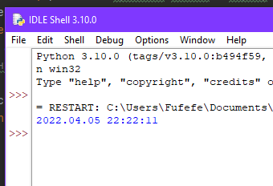
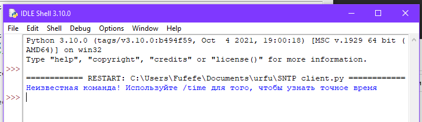

Тема 1, задача №2

Конфигурационный файл с названием config.txt содержит целое число в первой строке -
количество секунд, на которое врёт SNTP сервер.

Задача в файле `sntp_task.py`

Функция main() запускает сервер, который слушает udp на 123 порту на 127.0.0.1 .
Когда на сервер приходит команда `/time`, сервер отправляет текущее время, установленное на компьютере, со сдвигом
на количество секунд из конфигурационного файла.

Сервер не обрывает соединение до тех пор, пока клиент сам его не закроет либо не отправит пустую строку.
Программа работает в вечном цикле, обслуживая одного клиента за раз.

В файле `client.py` приведен пример запроса клиента.

*Примеры работы программы:*

