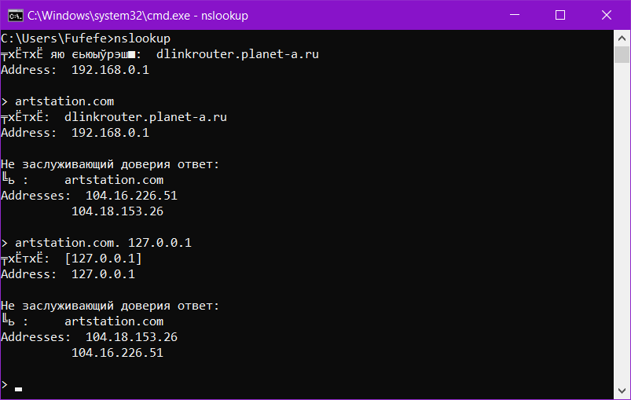
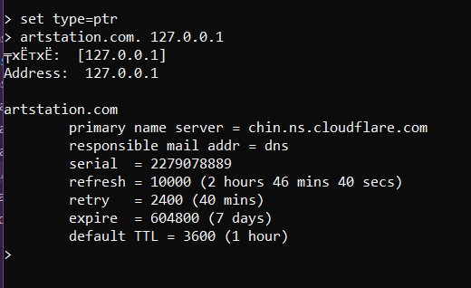
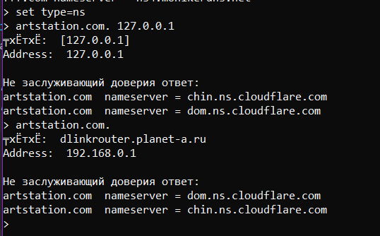
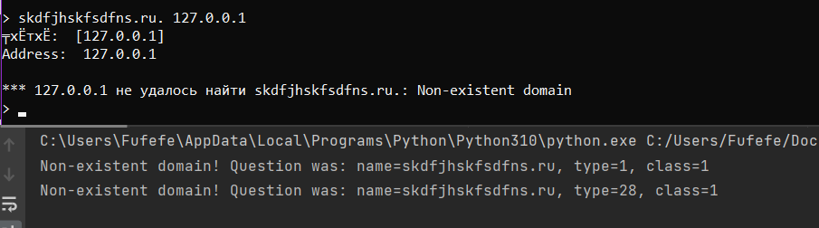
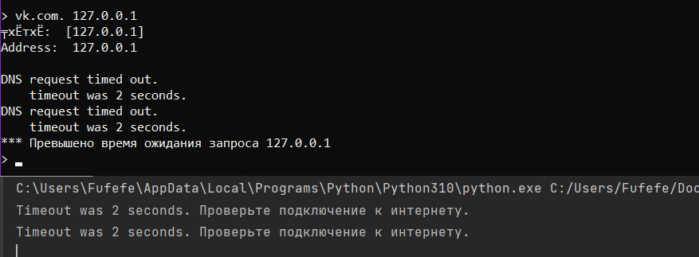

Тема 2, задача кэширующий DNS

Задача в файле `dns_server.py`

Функция `main()` запускает сервер, который слушает udp на 53 порту на 127.0.0.1 .
Когда серверy приходит запрос в виде пакета, сервер пересылает каждый вопрос из запроса корневому серверу 198.41.0.4,
и получает от него ответ. Далее сервер отправляет рекурсивные запросы каждому серверу, к которому сказал 
обратиться корневой сервер. Затем сервер собирает все ответы в пакет, и отправляет его клиенту.

*Примеры работы программы:*

*Ошибка несуществующего доменного имени:*

*Ошибка истекшего времени ожидания:*
