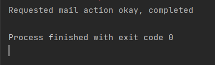
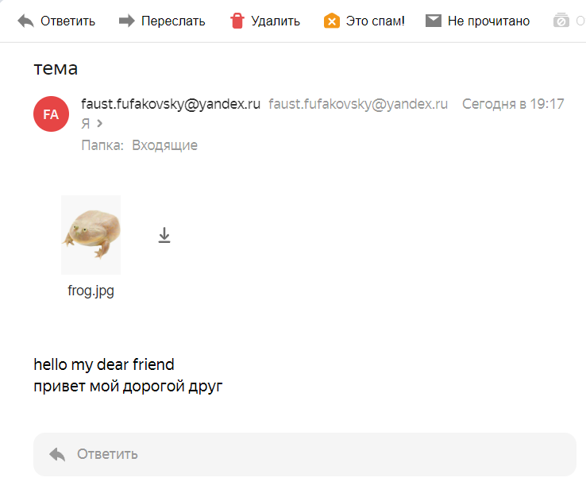
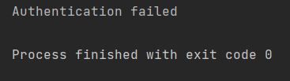

## SMTP client

Задача в файле `smtp.py`

### Как использовать:

В файл `headers.txt` добавить получателя и отправителя письма, тему, а так же MIME-версию.
В файл `settings.py` добавить логин пользователя (почту), пароль и почту получателя.
В файл `msg.txt` добавить текст сообщения, которое нужно отправить.
В папку `\attachments` при необходимости добавить вложения к письму.

### Примеры работы программы
*Пример успешного выполнения и результат*

*Пример выполнения с ошибкой:*
