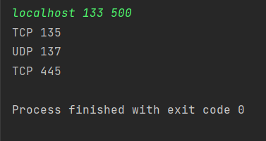

## TCP/UDP scanner
Сканирует заданный диапазон портов для заданного адреса и выводит открытые tcp и udp порты

### Как использовать:

Запустить программу, ввести адрес и диапазон портов через пробел.

### Примеры работы программы:

*Пример успешного выполнения и результат*

*Пример выполнения с ошибкой:*

